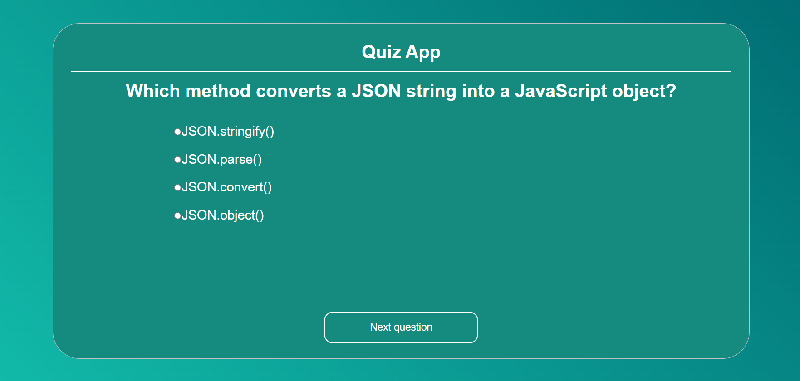

# Quiz App

A dynamic JavaScript quiz application built using modern **HTML, CSS, and JavaScript**.

This project showcases efficient client-side rendering, data persistence, and interactive question tracking across a multi-step form structure.

---

## Live Preview

Link: https://panwarcodes.github.io/playground/js-practise-projects/Quiz%20App/

---

## Features

- Dynamic UI rendering based on questions array
- Advanced event delegation architecture
- Input validation (guards "Next" and "Submit" options)
- "Free-pass" logic for the "Previous" navigation button
- State-preserving question tracker
- Index-locked answer logging (prevents duplicates on answer revision)
- Smart navigation panel (dynamically renders Previous, Next, and Submit buttons)
- Automated score sheet layout on completion

---

## Tech Stack

- HTML5
- CSS3
- JavaScript (ES6+)
- DOM Manipulation
- Event Delegation (`event.target`)
- Custom `data-*` Attributes

---

## What I Learned

- **Event Delegation:** Consolidating multiple element listeners into a single parent observer to save browser memory.
- **Control Flow & Guard Clauses:** Using early `return` paths to separate strict input validation blocks from free navigation paths.
- **Post-Increment Mechanics:** Debugging and moving past post-increment (`i++`) evaluation pitfalls in UI rendering cycles.
- **Index-Based State Array Tracking:** Targeting direct array index allocation (`array[index] = value`) to elegantly overwrite state values without duplicate array bloating.
- **Dynamic DOM Clearing:** Safely resetting child element groups using modern operations like `.replaceChildren()`.
- **Decoupled Architecture:** Using semantic `data-id` labels to run business logic independently of raw HTML text contents.

---

## How It Works

1. User is presented with a dynamic layout showing one query option card at a time.
2. Form event delegate captures radio input clicks and logs them tightly to the active index position.
3. The button engine checks for specific action identifiers (`next`, `previous`, `submit`).
4. "Next" and "Submit" options run validation criteria; users are stopped with alert prompts if an answer slot is empty.
5. "Previous" requests bypass form criteria to step back through old rendering logs immediately.
6. Triggering "Submit" runs an evaluation loop over the logged data structure to compare values and return a calculated scoreboard.
