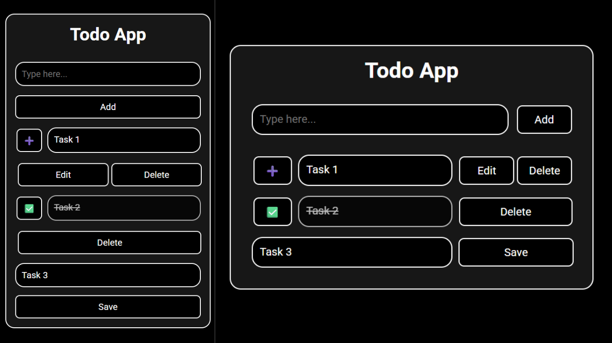

# Todo App

My first JavaScript project built completely from scratch — no tutorials used.

This project took around 5 days of work (3–4 hours daily) and involved a lot of debugging, experimentation, and learning how real applications manage data and UI.

Since this is my first complete JavaScript project, I felt it deserved its own repository.

This is **Version 3.5** of the project.

### Live Preview

https://panwarcodes.github.io/Todo-App

## Change Log

  
<b>Version 3.5</b>

  - Mobile responsive UI added
  - Mobile responsiveness improvements

  
<b>Version 3</b>

  - Changed tasks from simple strings into objects with status keys
  - Added true/false tracking using an `isCompleted` boolean property
  - Added line-through text and opacity styling for finished tasks
  - Created a clickable emoji button to toggle completion states
  - Replaced standard `<input>` boxes with multi-line `<textarea>` elements
  - Used `.scrollHeight` to auto-resize text boxes based on content
  - Synchronized the new object status back into `localStorage`
  - Reset the textarea heights back to original during submission

  
<b>Version 2</b>

  - Switched from multiple random keys to a single `localStorage` array
  - Used `JSON.stringify()` and `JSON.parse()` to handle the array data
  - Preserved the precise order of tasks using array index positions
  - Moved repeated HTML layout logic into a single `uiInstructor()` function
  - Fixed duplicate item bugs using `taskStorage.replaceChildren()`
  - Emptied active memory lists safely using `taskList.length = 0`
  - Deleted specific tasks from the array using `.splice()`
  - Reran `uiInstructor()` to refresh the screen instantly after edits

  
<b>Version 1</b>

  - Built a basic CRUD app using vanilla JavaScript
  - Saved individual tasks into separate `localStorage` text strings
  - Generated unique task keys using a custom `randomNum()` function
  - Used form submit events and `window.alert()` to block empty tasks
  - Used a standard `for` loop to load items from `localStorage` on refresh
  - Created new layout boxes dynamically using `document.createElement()`
  - Removed text elements and appended temporary inputs to edit tasks
  - Linked delete buttons to storage keys using `data-index` attributes

## Features

* **Add tasks**: Create new items instantly on screen
* **Edit tasks**: Change text inline using dynamic inputs
* **Delete tasks**: Remove tasks permanently from storage
* **Status toggling**: Switch completion states with emoji buttons
* **LocalStorage backup**: Save data directly in browser memory
* **Auto-loading**: Pull saved tasks automatically on reload
* **Real-time UI**: Update screen instantly without reloads
* **Form validation**: Block empty inputs via `window.alert()`
* **Multi-line edit**: Support long notes using `<textarea>`
* **Auto-resizing boxes**: Adjust input heights via `.scrollHeight`
* **Session persistence**: Keep completion styling intact always

## What I Learned

* **DOM manipulation**: Modify HTML nodes using JavaScript
* **Event listeners**: Handle user `submit` and `click` actions
* **Form handling**: Process values and reset input text
* **Dynamic creation**: Build layouts using `document.createElement()`
* **LocalStorage & JSON**: Convert arrays using `JSON.stringify()` / `parse()`
* **Data structures**: Group related items using objects
* **Array methods**: Delete specific tasks via `.splice()`
* **State management**: Track values like `isCompleted` booleans
* **UI re-rendering**: Clear old layouts using `.replaceChildren()`
* **Data-driven setups**: Separate background data from layout
* **Code refactoring**: Group matching logic inside `uiInstructor()`
* **JavaScript debugging**: Trace errors using `console.log()`

## Challenges Faced

* **Duplicate layouts**: Prevented double rendering by clearing HTML
* **Data synchronization**: Linked `localStorage` directly to UI updates
* **Dynamic listeners**: Attached events safely to new buttons
* **Task ordering**: Maintained exact sequences using array indexes
* **Element modification**: Swapped text nodes with input boxes
* **Reusable systems**: Built one central function for rendering
* **State tracking**: Matched line-through styles with true/false states
* **Text overflows**: Stopped layout breaking using auto-growing boxes

## Future Improvements

* [x] Fix task order after page refresh
* [x] Task completion / checkbox support
* [x] Mobile responsiveness improvements

---

More projects coming soon in my playground repository.
