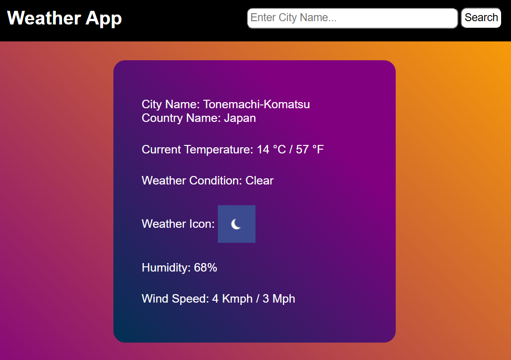

# Weather App

A simple weather application built using **HTML, CSS, and JavaScript**.

This project fetches live weather data from an API and dynamically updates the UI to display current weather information for a searched city.

---

## Live Preview

Link: https://panwarcodes.github.io/playground/js-practise-projects/Weather%20App/

---

## Features

- Search weather by city name
- Fetch live weather data
- Display:
  - City name
  - Country
  - Temperature (°C / °F)
  - Weather condition
  - Weather icon
  - Humidity
  - Wind speed
- Responsive UI
- Error handling for failed API requests
- Dynamic DOM updates
- Spinner animation

---

## Tech Stack

- HTML
- CSS
- JavaScript
- Fetch API
- Async/Await
- DOM Manipulation

---

## What I Learned

- Working with APIs
- Using `fetch()` for HTTP requests
- Async JavaScript (`async/await`)
- Error handling with `try/catch`
- Updating UI dynamically
- Separating data fetching and UI rendering
- Handling form submissions
- Spinner animation

---

## How It Works

1. User enters a city name.
2. Form submission triggers an API request.
3. Weather data is fetched from the weather service.
4. UI updates automatically with received information.